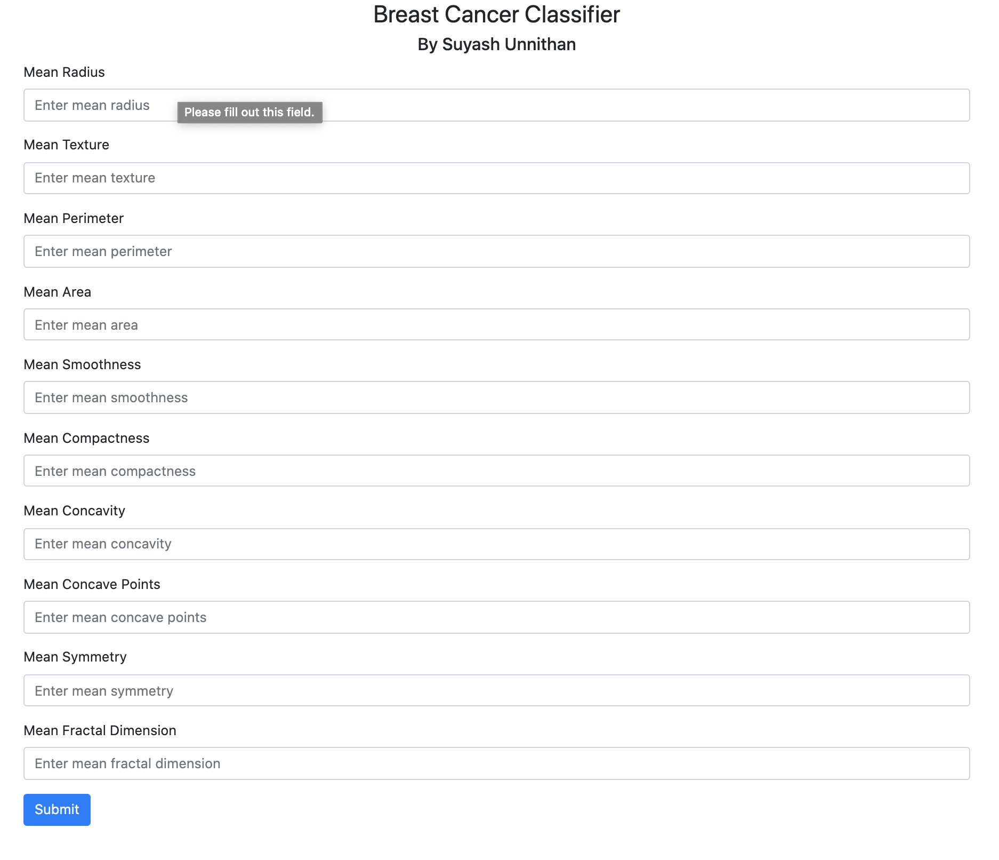
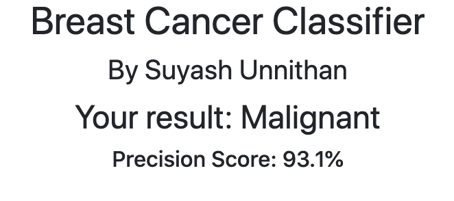

# BreastCancerClassifier
Breast Cancer ML Model using Sklearn deployed on a Flask App.

Predicts if tumors in the breast are **malignant** (cancerous) or **benign** (non-cancerous).

Trained using: https://archive.ics.uci.edu/ml/datasets/Breast+Cancer+Wisconsin+%28Diagnostic%29

The model was finetuned to an accuracy of **93.1%**.

The flask web app allows a user to input numeric characteristics about a tumour which allows the model to predict whether the tumors is malignant or benign.

**Screenshots:**

